## Beskrivning av projektet

Detta projekt är ett backend-API byggt med Node.js, Express och PostgreSQL.
SQL Bulletin är en enkel meddelandetjänst som fungerar som en digital anslagstavla. Tjänsten tillåter användare att skapa och hantera kanaler, prenumerera på dessa samt posta och läsa meddelanden i kanaler de är medlemmar i. Vi har fokuserat på och skapa projektet emot G nivå med alla guldstjärneuppgifter förutom nedanstående punkter:

-Ett meddelande kan tillhöra en eller flera kanaler.
-Det går att sortera meddelanden på datum.
-API, ER-diagram och databasstruktur reflekterar detta
-Postman-dokumentation finns även för detta utökade flöde

## 1.Hur man startar projektet

-git clone - för att klona projektet
-npm install -för att få hem alla dependencies
-skapa databas i PostgreSQL

- lägga in era credentials i en env fil, (se .envexample)
- kör node setup-db.js i terminalen för att skapa tabeller
- kör node server.js för att starta servern(http://localhost:6000)

## 2.Postman

Bilder finns i mappen images och är kopplade till olika end-points

//POST – skapa nya resurser

POST /users- 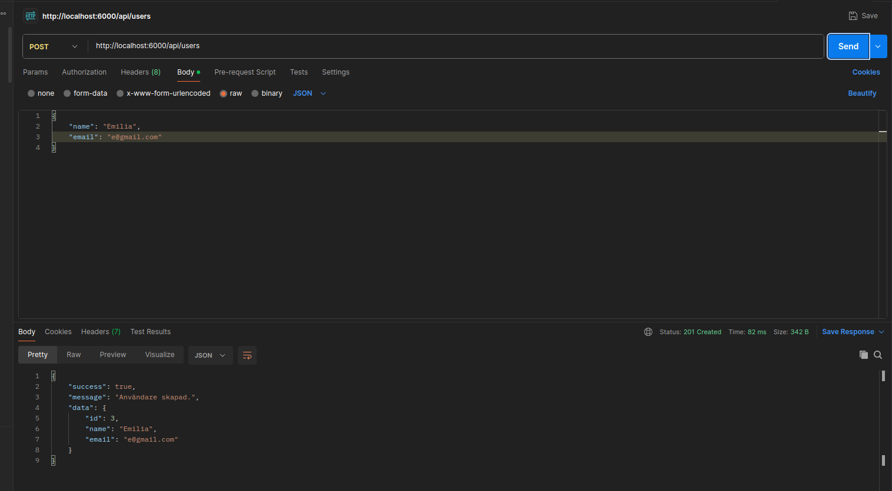
POST /channels 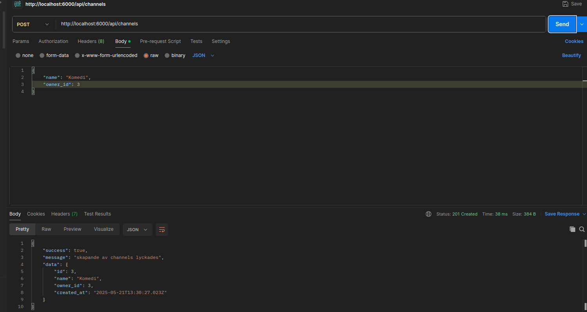
POST /subscriptions 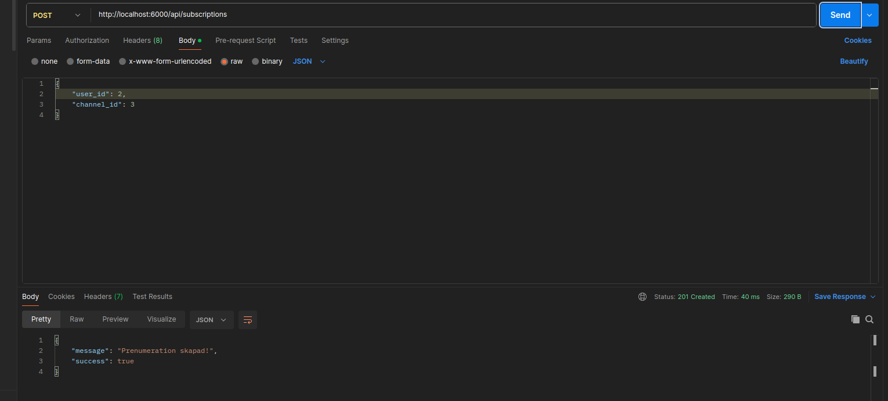
POST /messages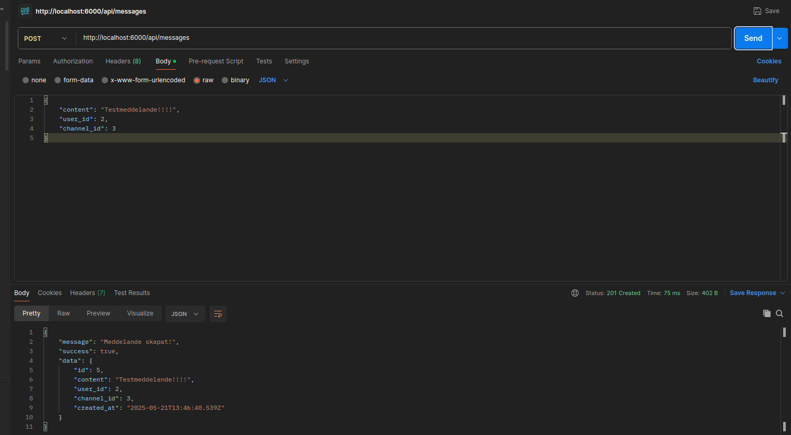

//GET – hämta resurser

GET /channels/:id/messages?userId=2 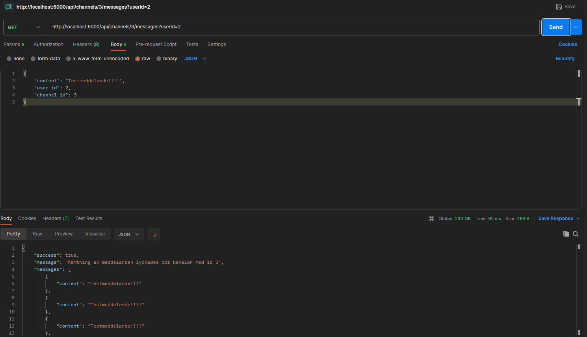
GET /users/:id/channels 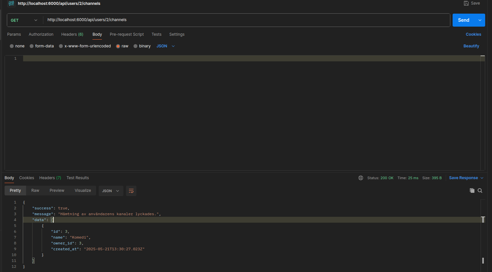

//DELETE – ta bort resurser

DELETE /channels/:id 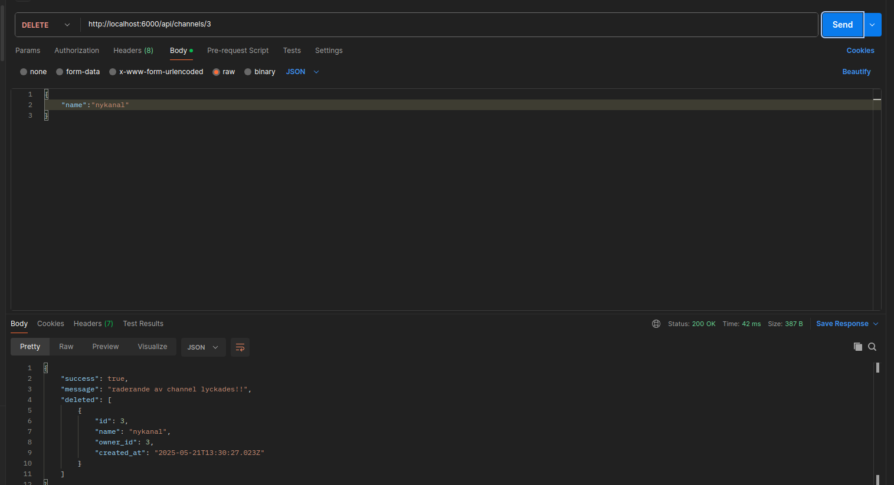
DELETE /subscriptions/:userId/:channelId 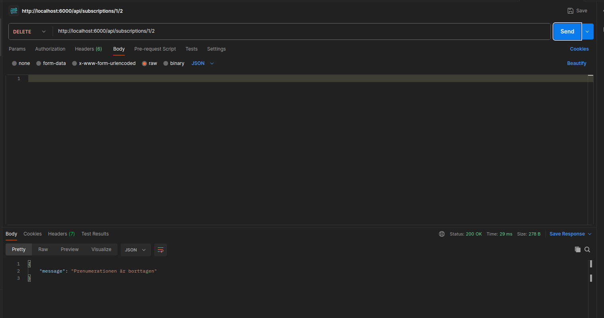

//PUT eller PATCH – uppdatera resurser

PATCH /messages/:id 
PATCH /channels/:id 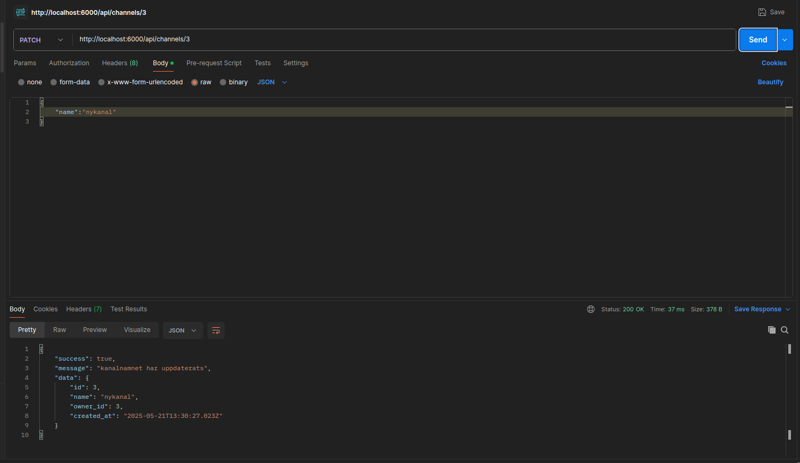

## 3.Pg-admin

För att se att datan kommit in i tabellerna använder vi oss av Pg-admin
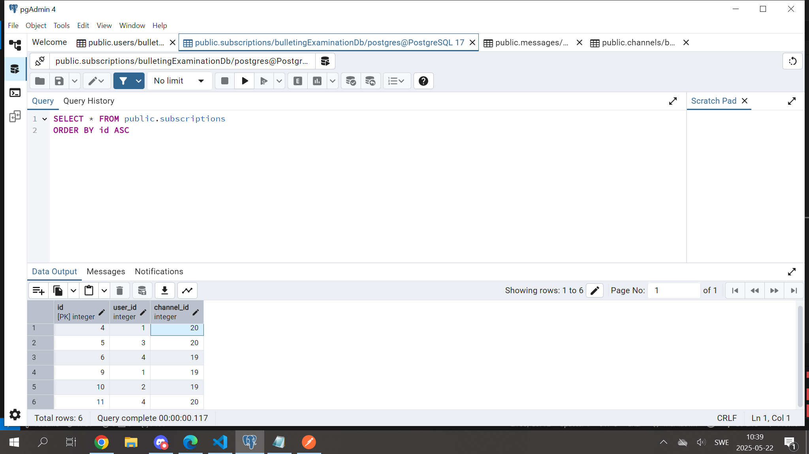

## 4 ER-diagram

Länk till ER-diagram 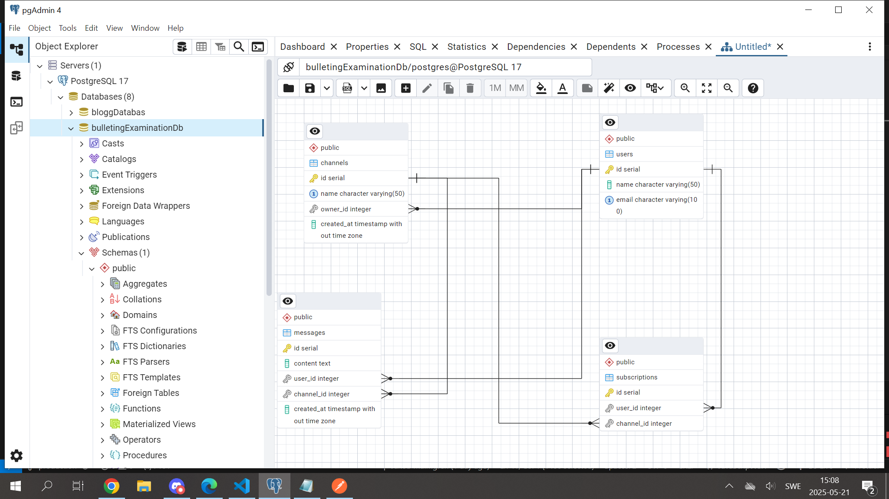
