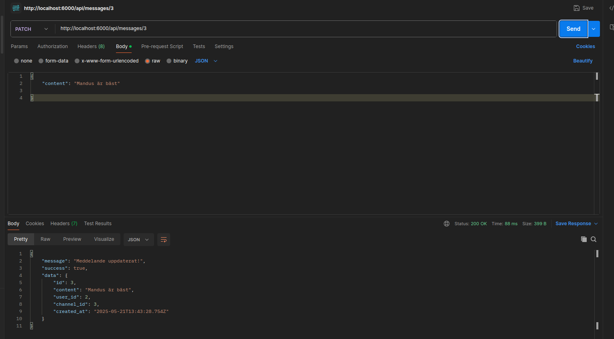

1.Hur man startar projektet

-git clone - för att klona projektet
-npm install -för att få hem alla dependencies
-skapa databas i PostgreSQL

- lägga in era credentials i en env fil, (se .envexample)
- kör node setup-db.js i terminalen för att skapa tabeller
- kör node server.js för att starta servern(http://localhost:6000)

  2.Postman

  \*Bilder finns i mappen images och är kopplade till olika end-points/ER-diagram.

//POST – skapa nya resurser

POST /users- 
POST /channels 
POST /subscriptions 
POST /messages

//GET – hämta resurser

GET /channels/:id/messages
GET /users/:id/channels

//DELETE – ta bort resurser

DELETE /channels/:id 
DELETE /subscriptions/:userId/:channelId

//PUT eller PATCH – uppdatera resurser

PATCH /messages/:id 
PATCH /channels/:id 

3.Pg-admin
